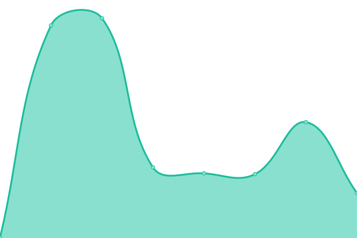
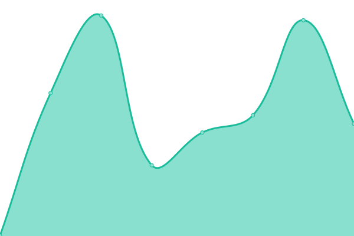

# [📈 Live Status](https://KusStar.github.io/serious-uptimes): <!--live status--> **🟩 All systems operational**

This repository contains the open-source uptime monitor and status page for [嚴肅遊戲](kusstar.uselessthing.top), powered by [Upptime](https://github.com/upptime/upptime).

With [Upptime](https://upptime.js.org), you can get your own unlimited and free uptime monitor and status page, powered entirely by a GitHub repository. We use [Issues](https://github.com/KusStar/serious-uptimes/issues) as incident reports, [Actions](https://github.com/KusStar/serious-uptimes/actions) as uptime monitors, and [Pages](https://KusStar.github.io/serious-uptimes) for the status page.

<!--start: status pages-->
<!-- This summary is generated by Upptime (https://github.com/upptime/upptime) -->
<!-- Do not edit this manually, your changes will be overwritten -->
<!-- prettier-ignore -->
| URL | Status | History | Response Time | Uptime |
| --- | ------ | ------- | ------------- | ------ |
|  [Useless Thing](https://uselessthing.top/) | 🟩 Up | [useless-thing.yml](https://github.com/KusStar/serious-uptimes/commits/HEAD/history/useless-thing.yml) | 

 440ms
     
 | 

<a href="https://KusStar.github.io/serious-uptimes/history/useless-thing">100.00%</a>
    

|  [Rewind](https://rewind.uselessthing.top/) | 🟩 Up | [rewind.yml](https://github.com/KusStar/serious-uptimes/commits/HEAD/history/rewind.yml) | 

 402ms
     
 | 

<a href="https://KusStar.github.io/serious-uptimes/history/rewind">100.00%</a>
    

|  [Krids](https://krids.uselessthing.top/) | 🟩 Up | [krids.yml](https://github.com/KusStar/serious-uptimes/commits/HEAD/history/krids.yml) | 

 326ms
     
 | 

<a href="https://KusStar.github.io/serious-uptimes/history/krids">100.00%</a>
    

|  [Krude](https://krude.uselessthing.top/) | 🟩 Up | [krude.yml](https://github.com/KusStar/serious-uptimes/commits/HEAD/history/krude.yml) | 

 396ms
     
 | 

<a href="https://KusStar.github.io/serious-uptimes/history/krude">100.00%</a>
    

<!--end: status pages-->

[**Visit our status website →**](https://KusStar.github.io/serious-uptimes)

## 📄 License

- Powered by: [Upptime](https://github.com/upptime/upptime)
- Code: [MIT](./LICENSE) © [嚴肅遊戲](kusstar.uselessthing.top)
- Data in the `./history` directory: [Open Database License](https://opendatacommons.org/licenses/odbl/1-0/)
